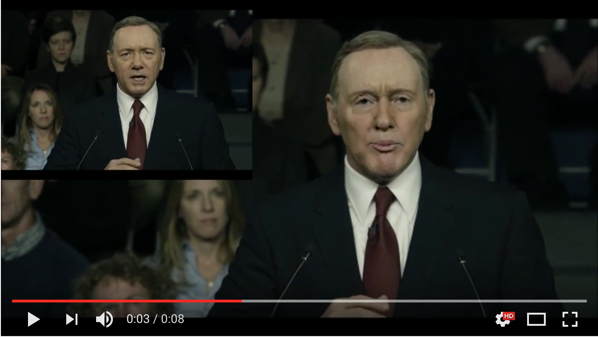

# Automatic Seamless Face Replacement in Videos
-Yiren Lu (luyiren [at] seas [dot] upenn [dot] edu)
-Dongni Wang (wdongni [at] seas [dot] upenn [dot] edu)

Python third party libs used:
  - dlib
  - cv2
  - skimage
  - scipy.io

To run face replacement:

1) Face detection (for both source video and destination video):
Python face_detect_wrapper.py shape_predictor_68_face_landmarks.dat [video_name]

video_name no suffix, e.g.:
Python face_detect_wrapper.py shape_predictor_68_face_landmarks.dat clips/clip1

Example outputs in ./Proj4_Test and ./clips

2) Face replacement:
See demo.m

  a) load face detection results output by 1)
  b) run replace_all_faces([src video path], [replacement video path], [src video detection results], [source video detection results], [destination video detection results], [source face index], [resize x])
  c) save video to .avi file

Example output videos in ./output_videos

Youtube video demo:

More details in project report:
<https://github.com/stormmax/seamless_face_replacement/blob/master/project_description.pdf>